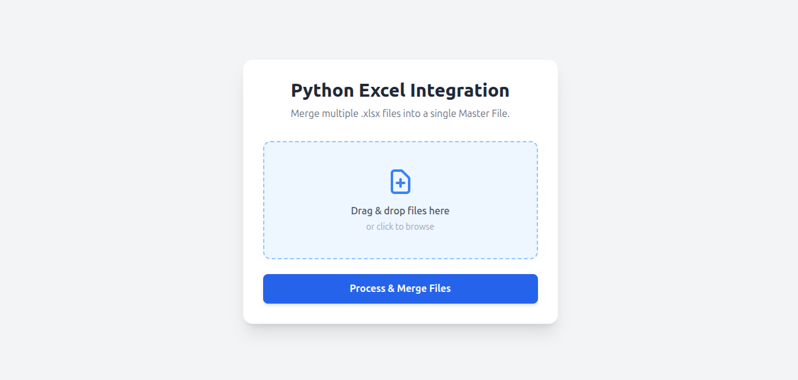

# Python Excel Integration

A lightweight Django web application for merging multiple Excel files (.xlsx/.xls) into a single downloadable Excel workbook.

## Overview

This project provides a simple web interface where users can upload several Excel files, have them processed server-side with pandas and openpyxl, and receive a merged file named Master_Rekap_Data.xlsx.

The application also records each processing attempt in the database through the MergeHistory model so that merge activity can be reviewed later.

## Features

- Upload multiple Excel files through a drag-and-drop style web interface.
- Merge uploaded files into one workbook in memory and download it as Master_Rekap_Data.xlsx.
- Preserve a basic audit trail in the database with file count, row count, status, and error details.
- Show clear error feedback when a merge fails instead of silently failing.
- Support local development and Docker-based deployment.

## Technology stack

- Django 6.0.2
- pandas
- openpyxl
- whitenoise
- SQLite (default database)
- Docker Compose

## Project structure

- manage.py — Django CLI entry point.
- core/settings.py — Django project configuration.
- core/urls.py — URL routing configuration.
- tools/views.py — Main upload and merge processing logic.
- tools/models.py — MergeHistory model for storing merge history.
- tools/templates/merge_tool.html — Frontend UI for file upload and download.
- excel_dummy.py — Helper script to generate example Excel files.
- requirements.txt — Python dependencies.
- docker-compose.yml — Docker Compose configuration.
- Dockerfile — Container build definition.

## Requirements

- Python 3.10+ recommended
- pip

Install dependencies with:

```bash
python -m venv .venv
source .venv/bin/activate
pip install -r requirements.txt
```

## Environment configuration

Create a .env file in the project root before running the app.

Example:

```bash
SECRET_KEY=your-secret-key
DEBUG=True
```

The application reads these values from the .env file through Django settings.

## Local development

1. Create and activate a virtual environment.
2. Install dependencies.
3. Create the .env file with the required variables.
4. Apply migrations:

```bash
python manage.py migrate
```

5. Optional: create an admin user to inspect MergeHistory in Django admin:

```bash
python manage.py createsuperuser
```

6. Start the development server:

```bash
python manage.py runserver
```

7. Open http://127.0.0.1:8000/ in your browser.

## Testing

Run the regression tests with:

```bash
DJANGO_SETTINGS_MODULE=core.settings python manage.py test tools.tests
```

The suite covers the success path for Excel merging and the failure path for merge errors.

## Docker usage

This project includes a Docker Compose setup for running the web service.

```bash
docker compose up --build
```

The configuration exposes port 8000 and uses the local db.sqlite3 file as a mounted volume so that merge history remains available between container restarts.

## How to use the app

1. Open the web interface.
2. Select or drag and drop one or more .xlsx/.xls files.
3. Click Process & Merge Files.
4. The browser will automatically download the merged file as Master_Rekap_Data.xlsx.

If some files cannot be read, the app will show an error message and continue processing the files that can be read. The merge history entry will capture the relevant error information.

## Example files

You can generate sample Excel files with the included helper script:

```bash
python excel_dummy.py
```

## Screenshot



## Notes

- The merge process runs in memory and writes the final workbook to a temporary buffer before sending it to the browser.
- The current setup is intended for development use. For production, review environment variables, secret key handling, and deployment settings carefully.
- A recent bug in the failure path caused merge errors to be recorded as a tuple instead of a readable string. This has been corrected so the UI and history record now show a clear error message.

## License

This project does not currently include a license file. Add one if you plan to publish or distribute the project.
